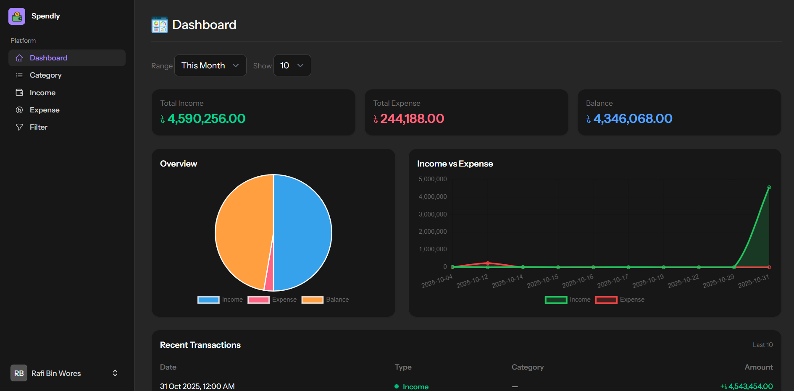
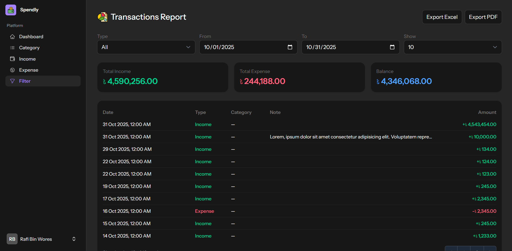
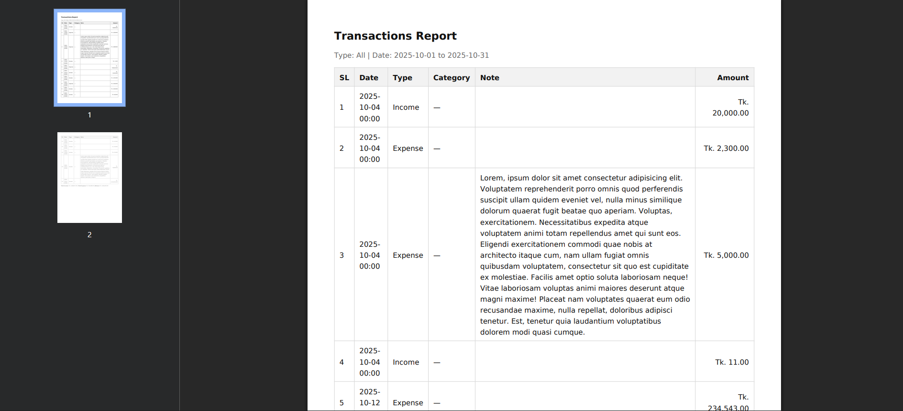

# 💰 Spendly – Smart Expense Tracker

[](https://laravel.com)
[](https://php.net)
[](https://mysql.com)
[](LICENSE)

> **Spendly** is a modern and intuitive **expense tracking application** built with **Laravel 12 + Livewire + Tailwind CSS** that helps users manage their **income, expenses, and financial insights** effortlessly.

---

## 🧭 Overview

Spendly helps you stay in control of your finances by logging, filtering, and analyzing your income and expenses in real time — all from a clean and responsive dashboard.

### ✨ What You Can Do:
- 💵 Add, edit, or delete **income and expense** entries  
- 📅 Filter data by **type** (income/expense) and **date range**  
- 📊 View **interactive charts** for financial insights  
- 📥 Export reports in **Excel** and **PDF** formats  
- 🔢 Automatically add **serial numbers** to reports  
- 💬 Notes field with **fixed width** for clear readability  
- 🇧🇩 Automatically display **৳ (BDT)** before all amounts  

---

## 📸 Screenshots

| Dashboard | Filter View | Export Report |
| :--: | :--: | :--: |
|  |  |  |

---

## 🚀 Features

- 🔐 **User Authentication** – Secure login & registration  
- 💸 **Income & Expense Tracking** – Categorize and record all transactions  
- 📆 **Date Range Filter** – View transactions by custom time periods  
- 📊 **Dynamic Charts** – Visual representation of spending trends  
- 📁 **Export to Excel & PDF** – Generate and download reports  
- 🧠 **Smart Categorization** – Classify expenses by category or source  
- 🌗 **Dark Mode Ready** – Beautiful responsive interface with TailwindCSS  
- ⚡ **Real-Time Updates** – Livewire powered for a smooth UX  

---

## 🛠 Tech Stack

| Layer | Technology |
|-------|-------------|
| **Backend** | Laravel 12 (PHP 8.4) |
| **Frontend** | Blade, Livewire, Alpine.js, TailwindCSS |
| **Database** | MySQL / MariaDB |
| **Authentication** | Laravel 12 in-build authentication |
| **Exporting** | Laravel Excel, DomPDF |
| **Charts** | Chart.js |
| **Version Control** | Git & GitHub |

---

## 📦 Installation

1. **Clone the repository**

   ```bash
   git clone https://github.com/RafiBinWores/Spendly.git
   cd Spendly
   ```

2. **Install dependencies**

   ```bash
   composer install
   npm install && npm run dev
   ```

3. **Setup environment variables**

   * Copy `.env.example` to `.env`
   * Update your database credentials

4. **Generate application key**

   ```bash
   php artisan key:generate
   ```

5. **Run migrations with seed data**

   ```bash
   php artisan migrate
   ```

6. **Start the development server**

   ```bash
   php artisan serve
   ```

7. **Access your app** at [http://localhost:8000](http://localhost:8000)

---

## 🧩 Modules

| Module                  | Description                                 |
| ----------------------- | ------------------------------------------- |
| **Dashboard**           | Overview of total income, expenses & charts |
| **Category Management** | Add or update expense categories with icons |
| **Income Log**          | Add income source with type & dat           |
| **Expense Log**         | Add daily transactions with type & date     |
| **Filters**             | Filter transactions by date or type         |
| **Reports**             | Download filtered data as Excel or PDF      |


## 🔮 Future Improvements

* 📈 Budget goal tracking
* 🔔 Smart spending alerts
* 📱 PWA (Mobile App) version
* 🌐 Multi-language support

---

## 📜 License

This project is licensed under the [MIT License](LICENSE).
Feel free to fork, improve, and customize Spendly for your own needs.

---

## ⭐ Support

If you like this project, please give it a star on GitHub!
It helps others discover Spendly and motivates further development.
